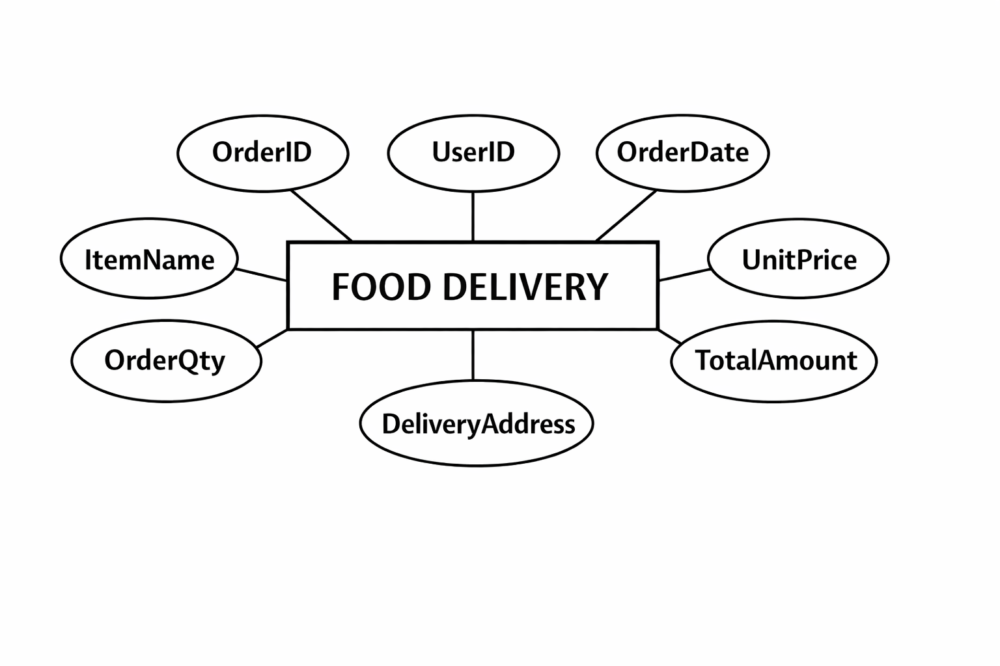

# Ex02 Django ORM Web Application
## Date: 03/02/2026

## AIM
To develop a Django application to manage an online food delivery platform like Zomato/Swiggy using Object Relational Mapping (ORM).

## ENTITY RELATIONSHIP DIAGRAM





## DESIGN STEPS

### STEP 1:
Clone the problem from GitHub

### STEP 2:
Create a new app in Django project

### STEP 3:
Enter the code for admin.py and models.py

### STEP 4:
Execute Django admin and create details for 10 books

## PROGRAM
```
admin.py
 
from django.contrib import admin
from .models import Orderitem
admin.site.register(Orderitem);
class OrderitemAdmin(admin.ModelAdmin):
        list_display = ('ordid','userid','orddate','deliveryaddress','itemname','unitprice''ordqt','totalamount')
```
```
models.py

from django.db import models

class Orderitem(models.Model):
    ordid = models.IntegerField(primary_key=True)
    userid = models.IntegerField()
    orddate = models.DateField()
    deliveryaddress = models.CharField()
    itemname = models.CharField()
    unitprice = models.FloatField()
    ordqt = models.IntegerField()
    totalamount = models.FloatField()
```


## OUTPUT


## RESULT
Thus the program for creating a database using ORM hass been executed successfully
